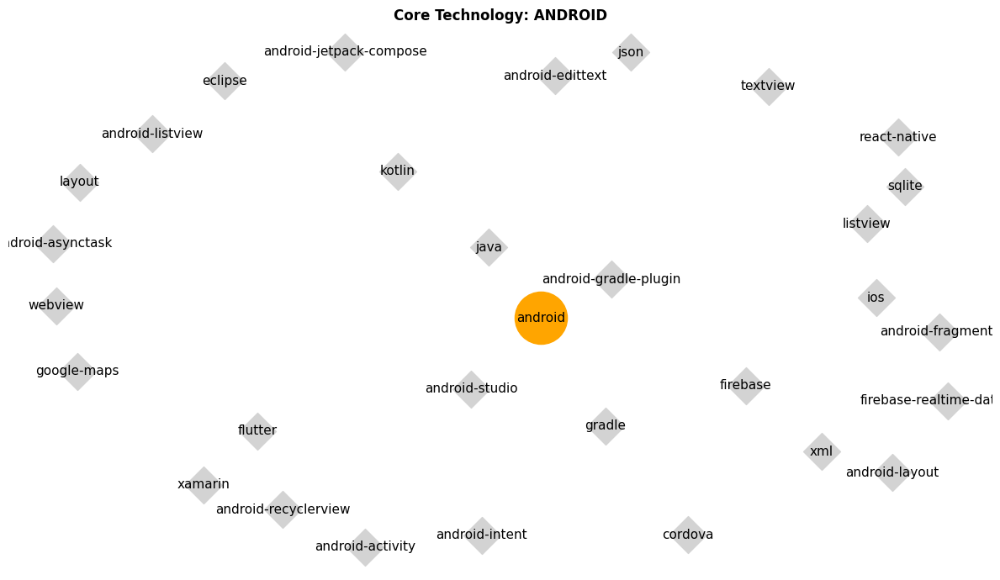
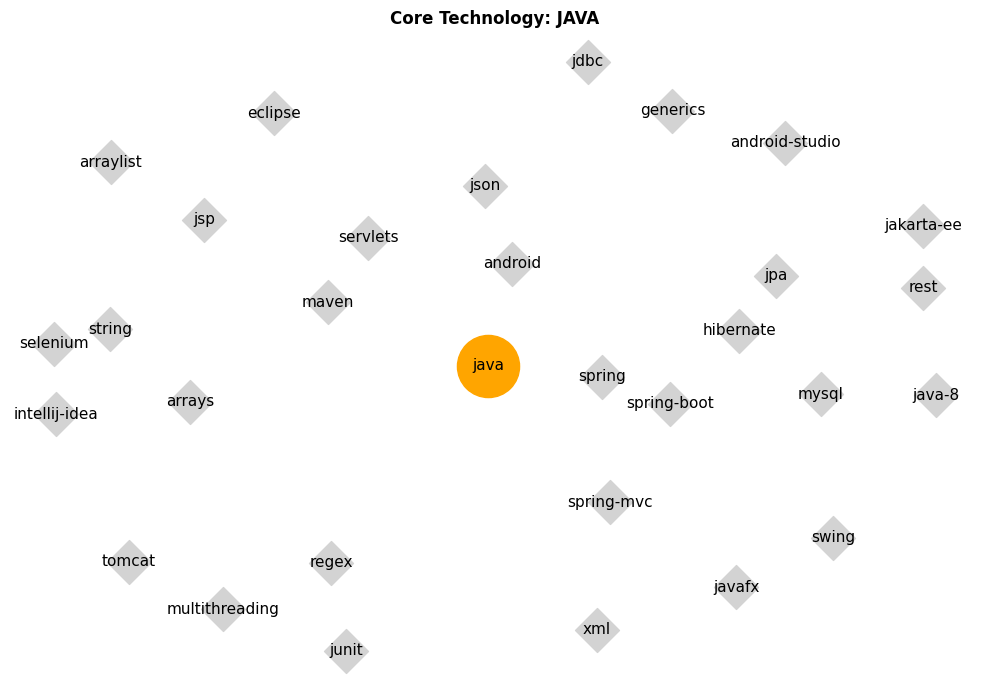
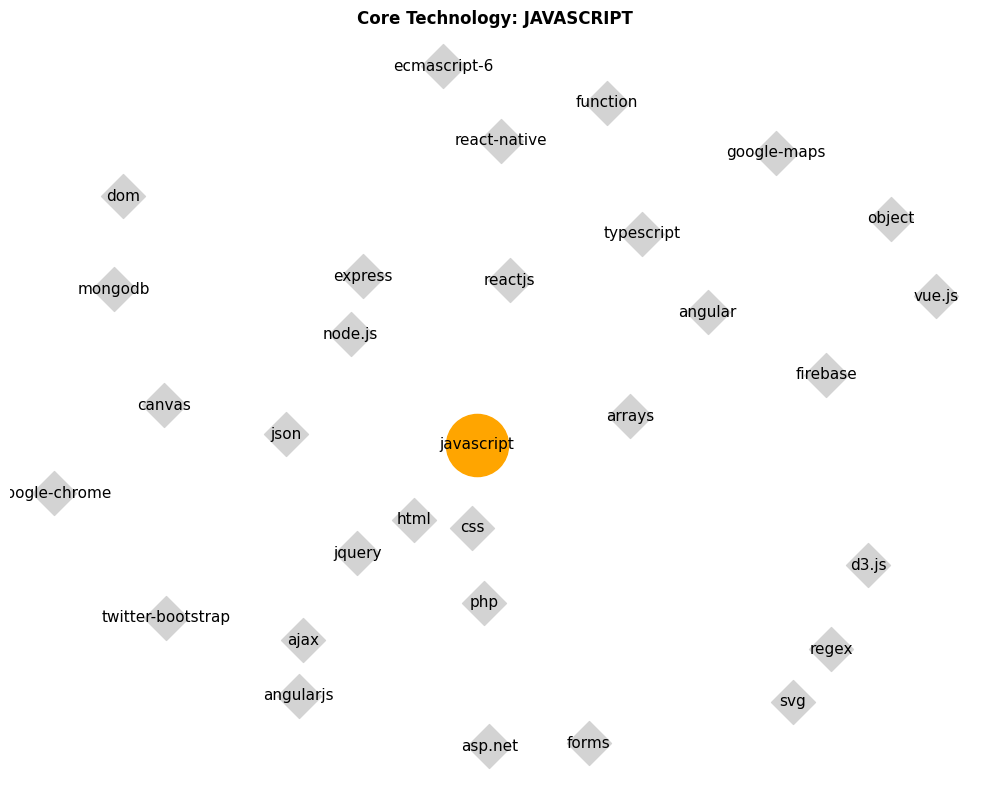
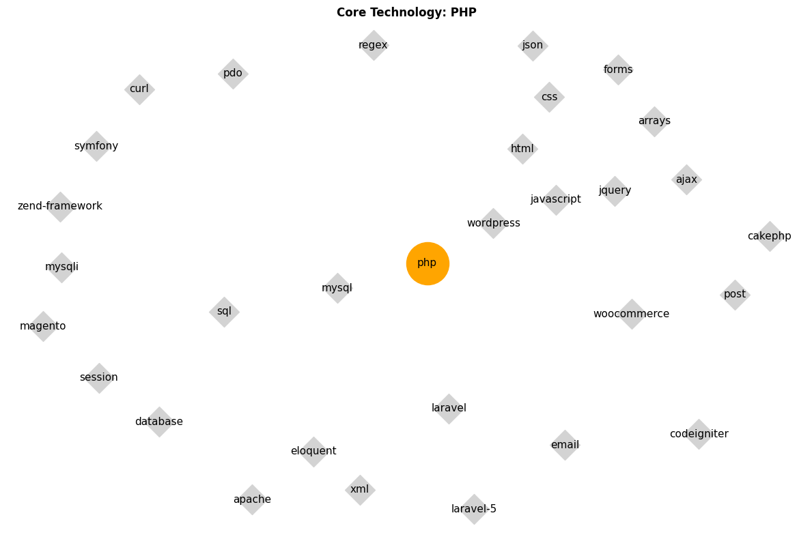
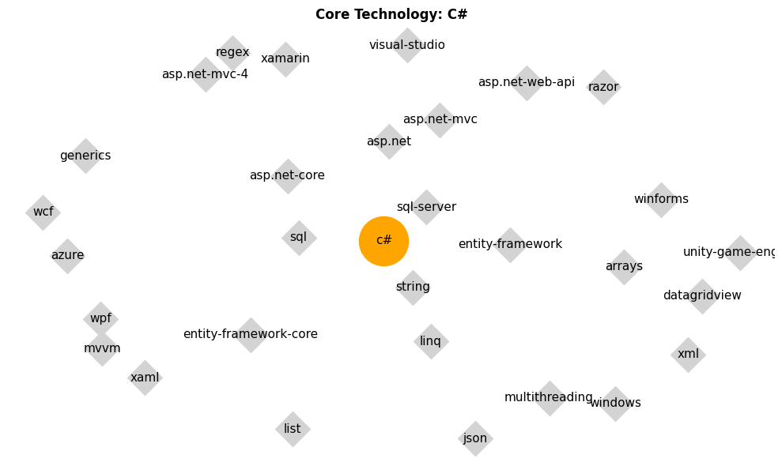
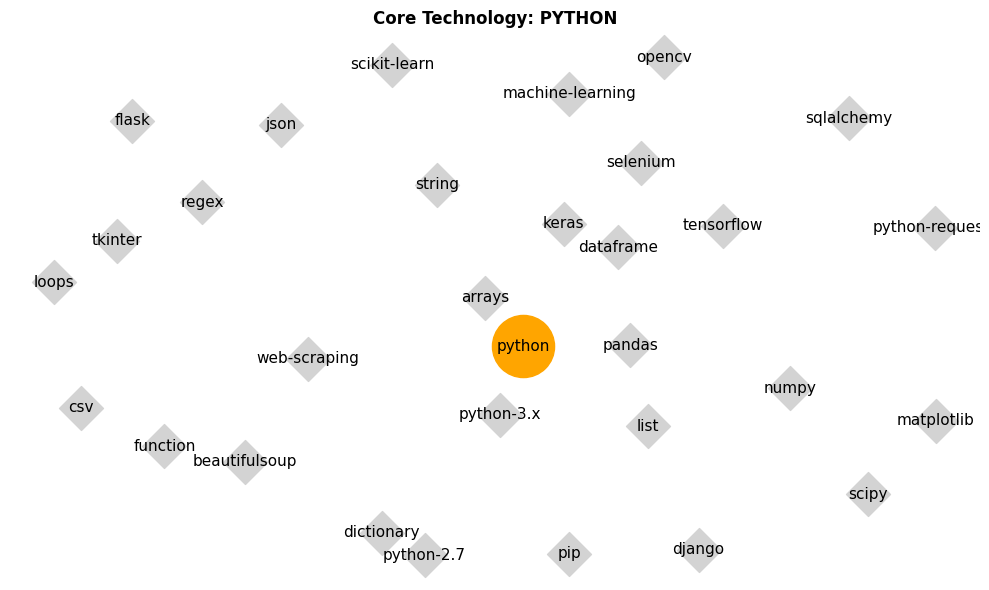

# Stack Overflow: Tag Co-occurrence Networks

**What technologies are commonly used together—and how are they connected?**


Tags on Stack Overflow often appear in clusters, reflecting real-world combinations of tools, languages, and frameworks used by developers.

In this project, I applied PySpark for large-scale processing of Stack Overflow data to analyze tag co-occurrences. By constructing a network graph with NetworkX, I uncovered meaningful technology clusters—revealing how different tools and languages naturally group together in practice, and offering insights into common tech stacks and developer ecosystems.

## Part 1: Data Preparation

The data is fetched directly from Google Cloud Storage, and for seamless integration, Google Colab is recommended as the development environment.

A Spark session is initiated to load the Stack Overflow *tags* and *posts* datasets.

To construct a DataFrame containing all question posts along with their associated tag lists, a PySpark `udf` (user-defined function) is used to extract tags by matching regex patterns within the tag strings. This results in a new column named `_TagList`, which contains parsed tags for each question—for example, the first question includes the following tags:

```python
questions_with_tags.take(1)[0]._TagList
# ['c++', 'qt', 'syntax-highlighting', 'qpainter']
```

## Part 2: Tag Pairs

Generate a table of unique tag pairs by applying the following filtering rules:

- Remove pairs where both tags are identical.
- Eliminate duplicate pairs by keeping only one instance of reversed pairs (e.g., retain either *(tag1, tag2)* or *(tag2, tag1)*, but not both).

Next, extract all tags and their corresponding occurrence counts from the tags dataset.

Count the number of posts in which each tag pair appears together. The resulting table includes:

- One row per unique tag pair
- A `co_occurrence_count` column indicating the number of posts where both tags are present

Finally, join this co-occurrence data with individual tag counts to produce a comprehensive **tag information table** that combines both pairwise co-occurrence and individual tag frequencies.

|      tag1       |         tag2         | co_occurrence_count | tag1_count | tag2_count |
| :-------------: | :------------------: | :-----------------: | :--------: | :--------: |
|        c        |       wireless       |          3          |   408021   |    688     |
|  configuration  | continuous-integr... |          3          |   18286    |   14155    |
| category-theory |       haskell        |         26          |    431     |   51622    |
|       ...       |         ...          |         ...         |    ...     |    ...     |

## Part 3: Similarity Score

Compute similarity scores between tag pairs using **Jaccard similarity**, which measures how often two tags appear together relative to how often they appear overall. The formula is as follows:

- **Numerator**: `co_occurrence_count` — the number of posts containing both tags (i.e., the intersection).
- **Denominator**: `tag1_count + tag2_count - co_occurrence_count` — the number of unique posts containing either tag (i.e., the union).

This results in a **Jaccard similarity score** for each tag pair, capturing the strength of association between the two tags based on their co-occurrence patterns across posts.

|     tag1      |         tag2         | co_occurrence_count | tag1_count | tag2_count | similarity           |
| :-----------: | :------------------: | :-----------------: | :--------: | :--------: | -------------------- |
|       c       |       wireless       |          3          |   408021   |    688     | 7.340239683293125E-6 |
| configuration | continuous-integr... |          3          |   18286    |   14155    | 9.248412355878907E-5 |
|      ...      |         ...          |         ...         |    ...     |    ...     | ...                  |

## Part 4: Most Strongly Connected Tag Pairs

To facilitate sorting and visualization of the similarity results, the final Spark DataFrame is converted to a Pandas DataFrame using the `.toPandas()` function. The resulting DataFrame contains **1,448,328 unique tag pairs**. Below is a list of the **top 10 most strongly connected tag pairs**, ranked by their Jaccard similarity scores:

|       tag1        |       tag2       | co_occurrence_count | similarity |
| :---------------: | :--------------: | :-----------------: | :--------: |
|    android-xr     |    scenecore     |          1          |     1      |
| fabric-lakehouse  | fabric-warehouse |          1          |     1      |
|     appenvoy      |   mobileposse    |          1          |     1      |
|    compress4j     |   jarchivelib    |          1          |     1      |
| isolated-context  |    rebrowser     |          1          |     1      |
|  mutablemapping   |   shadowsocks    |          1          |     1      |
|     harvester     |  harvester-hci   |          1          |     1      |
|   node-ottoman    |     ottoman      |          1          |     1      |
|      ton-gas      |     tvm-ton      |          1          |    0.5     |
| field-device-tool |    xdr-schema    |          1          |    0.5     |

- Eight tag pairs have a **similarity score of 1**, but each appears in only **one post**.
- The top 30 tag pairs with the highest similarity scores have co-occurrence counts of just 1 or 2, indicating very limited appearances.
- These results may be affected by **typos** (e.g., *"palmdb"* vs. *"pdb-palm"*) and **duplicate variations** (e.g., *"tina-cms"* vs. *"tinacms"*).

To enhance the quality of similarity insights, tag pairs with **low co-occurrence counts** are filtered out, as they often introduce noise due to rare, inconsistent, or erroneous tag entries. Therefore, only tag pairs with at least **500 co-occurrence instances** are retained. These filtered pairs are then ranked by their **Jaccard similarity scores**, resulting in the following list of the **top 10 most strongly connected tag pairs**:

|        tag1        |     tag2      | co_occurrence_count | similarity |
| :----------------: | :-----------: | :-----------------: | :--------: |
|       excel        |      vba      |        15856        |  0.032260  |
|        dart        |    flutter    |        7980         |  0.029625  |
|       cypher       |     neo4j     |         902         |  0.028108  |
|        css         |     html      |        48959        |  0.025093  |
|        dax         |    powerbi    |         751         |  0.024953  |
| google-apps-script | google-sheets |        2630         |  0.023975  |
|        jsf         |  primefaces   |        1199         |  0.022244  |
|   actionscript-3   |     flash     |        1650         |  0.022193  |
|      discord       |  discord.py   |         782         |  0.021456  |
|     dataframe      |    pandas     |        8925         |  0.020836  |

- While the highest similarity scores are now below **0.033**, this is expected due to the **large scale of the dataset**.
- The most strongly connected tag pairs include examples like **<"excel", "vba">** and **<"dart", "flutter">**, as shown in the table.
- Tag pairs with at least 500 co-occurrences demonstrate greater consistency and reliability, with no apparent issues related to typos or duplicate tags.

## Part 5: Technology Clusters with Core and Peripheral Technologies

To identify **technology clusters** and distinguish between **core and peripheral technologies**, a **network graph** is constructed using tag co-occurrence and similarity data.

- Each node in the graph represents a **technology tag**, and edges represent tag **co-occurrences**, weighted by their **Jaccard similarity scores**.
- **Degree centrality** is used to measure the influence of each node. Tags with a centrality score greater than **0.1** are considered **core technologies**.
- For each core technology, the **top 30 most similar peripheral technologies** are retained to form a cluster.

The core technologies identified include **'android'**, **'java'**, **'javascript'**, **'php'**, **'c#'**, and **'python'**.
The following visualizations illustrate the technology clusters centered around each of these core technologies:

- The identified technology cluster centers around Android, with peripheral technologies such as Android Layout, Android Studio, flutter and others.




- The identified technology cluster centers around Java, with peripheral technologies such as spring-boot, xml, Android and others.



- The identified technology cluster centers around Javascript, with peripheral technologies such as html, jquery, ajax and others.



- The identified technology cluster centers around PHP, with peripheral technologies such as ajax, jquery, arrays and others.



- The identified technology cluster centers around C#, with peripheral technologies such as asp.net-mvc, arrays and others.



- The identified technology cluster centers around Python, with peripheral technologies such as machine-learning, arrays, scikit-learn, numpy and others.


